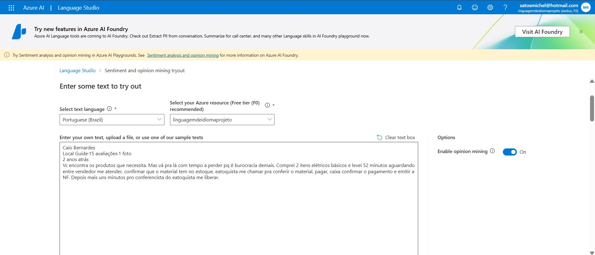
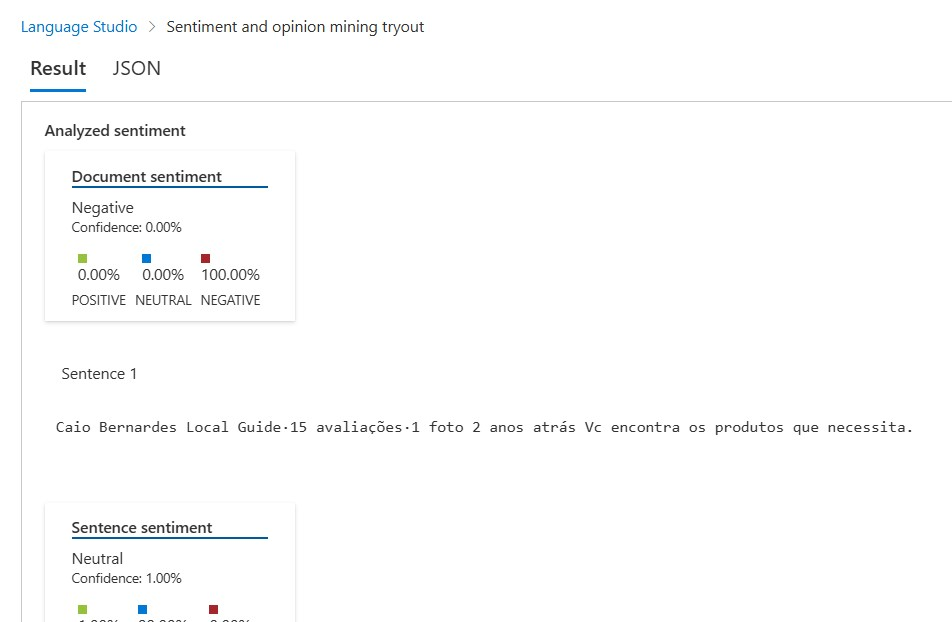
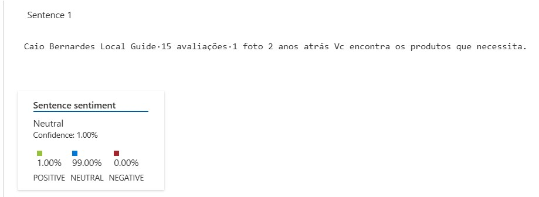
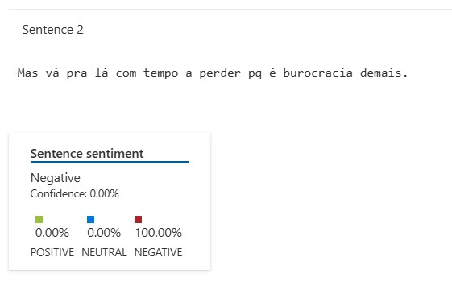
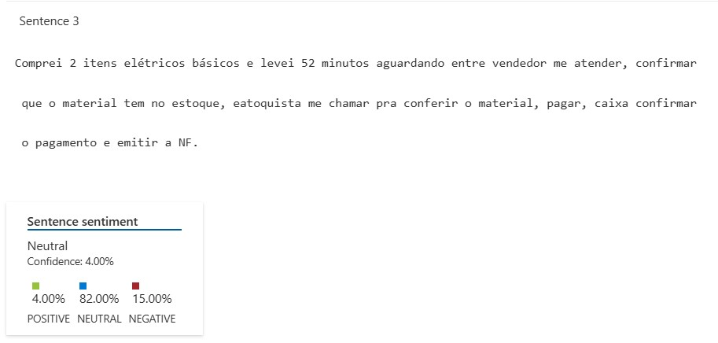
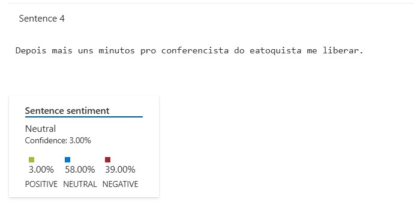

# Desafio de Projeto: Análise de Sentimentos de um Review de Cliente com Azure AI

Este repositório documenta a execução do desafio de projeto da [DIO](https://www.dio.me/) sobre as ferramentas de Inteligência Artificial da Microsoft. O foco deste trabalho foi utilizar o **Azure AI Language Studio** para realizar uma análise de sentimentos detalhada em um review real de cliente, extraído do Google.

## 🛠️ Ferramentas Utilizadas
* Microsoft Azure AI Language Studio
* GitHub para documentação e versionamento
* Markdown para formatação do documento

---

## 📖 Estudo de Caso: Análise de um Review Real no Google

Para o desafio, selecionei um review de 2 estrelas postado publicamente no Google. A escolha se deu por ser um exemplo autêntico de feedback de cliente, que mistura fatos com opiniões, tornando a análise pela IA mais desafiadora e interessante.

### Texto Analisado:
> Vc encontra os produtos que necessita. Mas vá pra lá com tempo a perder pq é burocracia demais. Comprei 2 itens elétricos básicos e levei 52 minutos aguardando entre vendedor me atender, confirmar que o material tem no estoque, eatoquista me chamar pra conferir o material, pagar, caixa confirmar o pagamento e emitir a NF. Depois mais uns minutos pro conferencista do eatoquista me liberar.

### Processo de Análise
O texto foi inserido na ferramenta "Sentiment analysis and opinion mining" do Azure Language Studio para avaliação do sentimento geral e de cada sentença individualmente.

---

## 🧠 Resultados e Insights da Análise

A ferramenta processou o texto e gerou resultados que revelam como a IA interpreta a linguagem humana, com seus pontos fortes e limitações.

### 1. Análise Geral do Documento
O sentimento geral do documento foi classificado como **100% Negativo**, o que condiz perfeitamente com a avaliação de 2 estrelas dada pelo cliente.

**Insight:** A IA conseguiu identificar corretamente o tom predominante do feedback, mesmo com a presença de sentenças neutras. Isso mostra a capacidade do modelo de ponderar as partes do texto e extrair a intenção principal do autor.

### 2. Análise Detalhada por Sentença

* **Sentença 1:** *Vc encontra os produtos que necessita.*
    * **Resultado:** Neutro (99%)
    * **Insight:** Esta é uma afirmação factual. A IA a interpretou corretamente como uma informação, sem carga emocional positiva ou negativa.

    

* **Sentença 2:** *Mas vá pra lá com tempo a perder pq é burocracia demais.*
    * **Resultado:** Negativo (100%)
    * **Insight:** Esta foi a sentença-chave que definiu o sentimento do review. As expressões "tempo a perder" e "burocracia demais" são indicadores de sentimento explicitamente negativos e foram capturados com máxima confiança pela IA.

    

* **Sentença 3:** *Comprei 2 itens elétricos básicos e levei 52 minutos aguardando...*
    * **Resultado:** Neutro (82%)
    * **Insight:** **Este é o resultado mais interessante.** Para um humano, a descrição de esperar 52 minutos para comprar 2 itens é obviamente uma péssima experiência. No entanto, a IA classificou a sentença como neutra porque ela é, em sua essência, uma **descrição factual de um processo**. Faltam palavras explicitamente negativas como "demora horrível" ou "serviço péssimo". Isso revela uma limitação importante: a IA analisa o que está escrito, mas nem sempre compreende o **contexto implícito** da situação.

    

* **Sentença 4:** *Depois mais uns minutos pro conferencista do eatoquista me liberar.*
    * **Resultado:** Neutro (58%)
    * **Insight:** Semelhante à sentença anterior, esta frase descreve a continuação da espera. Embora o contexto seja negativo, o texto em si é descritivo. O modelo atribuiu uma pequena porcentagem de negatividade (39%), mostrando que captou uma leve nuance, mas não o suficiente para classificar a sentença inteira como negativa.

    

---

## 💡 Conclusão do Desafio

Este exercício prático foi extremamente valioso para entender tanto o poder quanto as limitações da análise de sentimento por IA.

**Pontos Fortes:**
* A ferramenta é excelente para **triagem e classificação em massa** de feedbacks, identificando com precisão o sentimento geral de um texto.
* Ela reage fortemente a **palavras-chave com carga emocional explícita** (positivas ou negativas).

**Pontos de Atenção:**
* A IA pode ter dificuldade em interpretar o **sentimento implícito**, ou seja, situações que são negativas pelo contexto e não pelas palavras usadas.
* Sentenças que descrevem processos ou fatos tendem a ser classificadas como neutras, mesmo que descrevam uma experiência ruim.

Portanto, o Azure AI Language Studio é uma ferramenta poderosa para automatizar a análise de feedback, mas a revisão humana continua sendo crucial para interpretar as nuances e os contextos mais complexos por trás dos comentários dos clientes.
